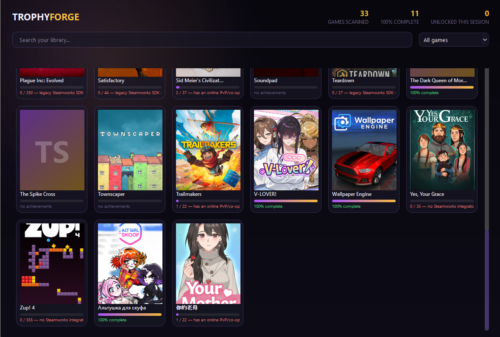

# TrophyForge

An offline Steam achievement manager for your own library. Scans installed
games, reads each one's achievement schema, and lets you unlock/lock
achievements locally through the Steamworks API — for games you own, that
have no online or VAC-protected component.



## Setup

```
python -m venv .venv
.venv\Scripts\pip install -r requirements.txt
.venv\Scripts\python main.py
```

Steam must be running and logged in.

After that, `run.bat` starts it. Don't double-click `main.py` — Windows hands
`.py` files to the global interpreter, which has no PySide6, so it dies on
the import before you can read the error.

## What it does — and deliberately doesn't

TrophyForge scans every installed game and shows achievement progress for
all of them. The **unlock/lock controls are only enabled for games that pass
every one of these checks**:

- Built against a modern Steamworks SDK (exports `SteamAPI_InitFlat`).
  Older SDKs route achievements through `ISteamClient` with a hand-guessed
  interface-version string; that path produced a corrupted interface
  pointer on a real game during development and isn't included here.
- A 64-bit game build. 32-bit-only titles need a separate process bridge
  (a 64-bit Python interpreter can't load a 32-bit DLL) — not implemented
  in this version.
- **Not** VAC-secured.
- **No** online PvP/co-op/MMO category on the store page.
- Category data was actually retrievable — if the check itself fails
  (offline, API error), the game is treated as unsupported rather than
  assumed safe.

Games that fail any of these still show up and are still browsable (reading
achievement state is a local, read-only query — no different from what the
Steam client already shows you), they just don't get an unlock button, and
the game screen explains which check failed.

This is not a configurable setting. It's the actual safety boundary of the
tool, not a missing feature — see `trophyforge/achievement_engine.py`'s
module docstring for the reasoning.

## Project layout

| File | Role |
|---|---|
| `trophyforge/steam_finder.py` | Locate Steam, its library folders, and every installed app manifest |
| `trophyforge/achievement_engine.py` | The Steamworks ctypes bridge, the safety gate, VAC/online detection |
| `trophyforge/schema_parser.py` | Turns an installed game into a full achievement list (names, rarity, unlock state) |
| `trophyforge/cache_manager.py` | Disk cache for cover art and achievement icons |
| `trophyforge/sound.py` | A synthesized unlock chime (no bundled audio asset) |
| `trophyforge/ui/` | PySide6 widgets — the card grid, the game screen, animations, theme |
| `main.py` | Entry point |

## Known limitations (v1)

- 32-bit-only games and legacy-SDK games are read-only (browsable, not
  unlockable) — see above.
- Achievement icons are fetched one at a time from the game's own live
  Steamworks session, queued on the engine thread and delivered by signal;
  for titles with very large achievement lists (500+) this takes a while to
  finish in the background. Nothing blocks — not the UI thread and not the
  shared thread pool — but the icons will visibly pop in gradually.
- The achievement list builds 25 rows per event-loop turn, so a very large
  list fills in over a few frames rather than appearing all at once.
- "Glassmorphism" here means semi-transparent panels + a glow shadow, not
  literal live background blur — Qt Widgets has no compositor-level blur
  without much heavier machinery (QGraphicsView/QML).
- Cache lives at `~/.trophyforge/cache`; a small stats file at
  `~/.trophyforge/stats.json` tracks how many achievements this app has
  unlocked, all-time.
